# Architecture Decision

## Tech Stack
Language : Go
Framework : gorilla/mux
Database : PostgreSQL

## Entity
- parents
    - id
    - name
- students
    - id
    - name
    - parent_id
- trial_classes
    - id 
    - name
    - quota
    - available_slots
- trial_class_members -- additional tables. this will added new members when bookings confirmed and payment_attempts success
    - id
    - trial_classes_id
    - student_id
- bookings
    - id 
    - trial_classes_id
    - student_id
    - status -- pending, confirmed, cancelled
    - idempotency_key
    - hold_expires_at
    - payment_code
    - created_at
    - updated_at
- payment_attempts
    - id 
    - booking_id
    - status -- pending, success, failed, refunded
    - note
    - created_at
    - updated_at

## API Endpoint
- POST /v1/trial_class.  
    Create trial_class
- POST /v1/parents   
    Create parent
- GET /v1/parents/:id.  
    Get detail parent
- POST /v1/students.  
    Create student
- GET /v1/students/:id.  
    Get detail student
- GET /v1/students/:id/bookings.  
    Get list bookings base on student_id
- POST /v1/booking.  
    Create booking class
- POST /v1/payment/settlement.  
    Confirm payment

## Flow Diagram

__Happy Path__

```mermaid
---
config:
    theme: redux-dark-color
---
sequenceDiagram
    actor Alice as Alice
    participant Booking
    participant Payment

    Alice->>+Booking: POST /v1/booking (student_id, trial_classes_id, idempotency_key)
    Booking->>Booking: update trial_class (available_slot=available_slot - 1) where available_slot > 0
    rect rgb(40, 60, 90)
        Note over Booking: BEGIN TRANSACTION
        Booking->>Booking: create booking (status=pending, hold_expire_at=5 minutes)
        Booking-->>-Payment: create payment_attempt (status=pending)
        Note over Booking,Payment: COMMIT
    end
    Booking->>+Alice: return payment code

    Alice->>+Payment: POST /v1/payment/settlement (payment_code, status)
    Payment->>Payment: update payment_attempt (status=success)

    Payment-->>Booking: update trial_class (available_slot=x)
    Booking->>Booking: update booking (status=success, hold_expire_at=0)

    Booking->>+Alice: Booking confirmed
```

__Last Seat Race__

```mermaid
---
config:
    theme: redux-dark-color
---
sequenceDiagram
    actor Alice
    actor John
    participant Booking
    participant Payment

    Alice->>+Booking: POST /v1/booking (student_id, trial_classes_id, idempotency_key)
    Booking->>Booking: update trial_class (available_slot=available_slot - 1) where available_slot > 0
    Note over Booking: (affected_rows = 1) mean successfully acquired available_slot

    John->>+Booking: POST /v1/booking (student_id, trial_classes_id, idempotency_key)
    Booking->>Booking: update trial_class (available_slot=available_slot - 1) where available_slot > 0
    Note over Booking: (affected_rows = 0) mean failed acquired available slot
    
    rect rgb(40, 60, 90)
        Note over Booking: BEGIN TRANSACTION booking Alice
        Booking->>Booking: create booking (status=pending, hold_expire_at=5 minutes)
        Booking-->>-Payment: create payment_attempt (status=pending)
        Note over Booking,Payment: COMMIT
    end
    Booking->>+Alice: return payment code

    Booking->>+John: return class full

    Alice->>+Payment: POST /v1/payment/settlement (payment_code, status)
    Payment->>Payment: update payment_attempt (status=success)

    Payment-->>Booking: update trial_class (available_slot=x)
    Booking->>Booking: update booking (status=success, hold_expire_at=0)

    Booking->>+Alice: Booking confirmed
```
